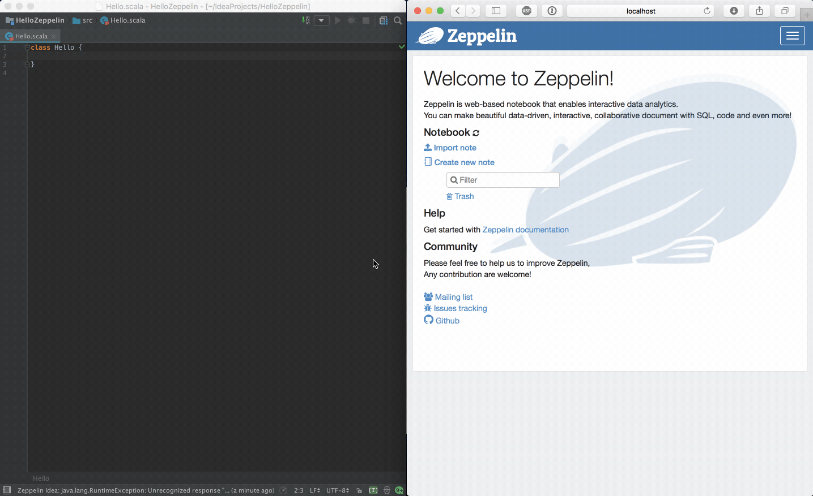
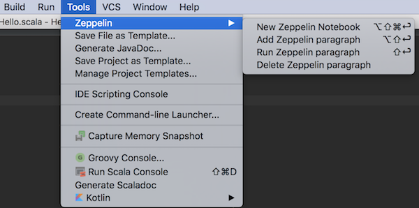

Intellij Zeppelin
=================

[Download](https://plugins.jetbrains.com/plugin/10023-intellij-zeppelin)

Features (v0.2):

- Create new Zeppelin notebook from within IntelliJ.
  With an opened `.scala` file, `Shift+Option+Command+Enter (Tools -> Zeppelin -> New Zeppelin Notebook)`
- Create and evaluate fragment of code in Zeppelin paragraph `Shift+Option+Enter (Tools -> Zeppelin - Add Zeppelin paragraph)`
- Delete a Zeppelin paragraph `Tools -> Zeppelin -> Delete Zeppelin paragraph`
- Run current line of code in Zeppelin `Shift+Enter (Tools -> Zeppelin -> Run Zeppelin paragraph)` 
- Set Zeppelin host & (optionally) username/password `IntelliJ Settings -> Languages and Frameworks -> Zeppelin Notebook`

